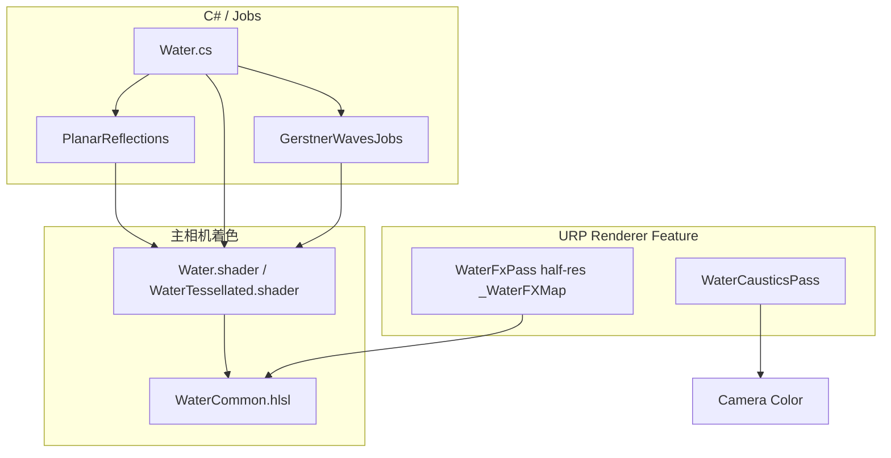

# BoatAttack 水面渲染系统参考文档

本文档描述当前工程中 **URP 水面** 的实现位置、渲染管线、数据与常见扩展点，供后续在 Cursor 中修改或排错时引用。

---

## 1. 总览

本仓库中存在 **两套水面包**（内容同源，二选一用于 gameplay；可并存仅用于「原版不动 + 副本搬运」）：

| 包文件夹 | 包名 (`package.json`) | C# 命名空间 | 主着色器前缀 | 用途 |
|----------|----------------------|-------------|--------------|------|
| `Packages/com.verasl.water-system` | `com.verasl.water-system` | `WaterSystem` | `BoatAttack/...` | **本 Demo 默认**；`Assets/Scripts` 下船只等使用 `using WaterSystem` |
| `Packages/com.boatattack.water-system-portable` | `com.boatattack.water-system-portable` | **`WaterSystemPortable`** | **`PortableWater/...`**、**`Hidden/PortableWater/Caustics`** | **原包未修改的完整拷贝**，独立 GUID，方便拷到其他工程；集成说明见包内 `README.md` |

以下「管线与概念」对两包相同；**脚本/API 路径**在副本中请使用 `WaterSystemPortable` 与包内 `README.md`。

核心思路：

- **Gerstner 波**：顶点阶段在 HLSL 中叠加位移与法线；运行时由 **Jobs + Burst** 在 CPU 侧同步高度，供物理与游戏逻辑采样。
- **岸线/水深**：俯视正交相机渲染深度到 `_WaterDepthMap`（或使用烘焙贴图 `bakedDepthTex`）。
- **水面细节与尾迹等**：URP **Renderer Feature** 在半透明队列中把带 `LightMode = WaterFX` 的物体渲染进半分辨率 `_WaterFXMap`，主水面着色器读取 **泡沫 R、法线 XZ、位移 A**。
- **反射**：`WaterSettingsData` 选择 **Cubemap / ReflectionProbe / PlanarReflection**；本 Demo 典型为平面反射，由 `PlanarReflections` 额外相机渲染到 `_PlanarReflectionTexture`。
- **焦散**：同一 Renderer Feature 在全屏四边形上叠加 `Hidden/PortableWater/Caustics`。

---

## 2. 目录与关键文件

| 类别 | 路径 |
|------|------|
| 运行时入口 | `Scripts/Water.cs` |
| 平面反射 | `Scripts/Rendering/PlanarReflections.cs`（命名空间 `UnityEngine.Rendering.Universal`，挂在 `Water` 同物体上） |
| URP Feature | `Scripts/Rendering/WaterSystemFeature.cs` |
| 波形数据 | `Scripts/Data/WaterSurfaceData.cs`、`Scripts/Data/WaterSettingsData.cs` |
| 资源 SO | `Scripts/Data/WaterResources.cs`，运行时 `Resources.Load("WaterResources")` |
| CPU 波高 | `Scripts/GerstnerWavesJobs.cs` |
| 浮力 | `Scripts/BuoyantObject.cs` |
| 主着色 | `Shaders/Water.shader`、`Shaders/WaterTessellated.shader` |
| 公共逻辑 | `Shaders/WaterCommon.hlsl`、`Shaders/WaterInput.hlsl`、`Shaders/WaterLighting.hlsl`、`Shaders/GerstnerWaves.hlsl` |
| WaterFX 材质用 | `Shaders/WaterFXShader.shader`（`PortableWater/WaterFXShader`，Pass 名 `WaterFX`） |
| 无限海面实验 | `Shaders/InfiniteWater.shader`（`WaterSettingsData.isInfinite`，注释中标注 shader 不完整） |
| 焦散 | `Shaders/Caustics.shader`（`Hidden/PortableWater/Caustics`） |

上表路径在两套包中**目录结构相同**，分别相对于 `Packages/com.verasl.water-system/` 或 `Packages/com.boatattack.water-system-portable/`。URP Renderer 上的 Feature、材质与着色器请与所选包一致（勿混用两包的材质与 `ScriptableObject` 引用）。

- `Assets/Data/WaterSettingsData.asset` — 反射类型、平面反射参数、几何类型等。
- `Assets/Data/WaterSurfaceData.asset` — 可见深度、吸收/散射 Gradient、波浪列表或程序化 BasicWaves、泡沫设置等。

---

## 3. `Water` 组件（`Water.cs`）

**单例**（`namespace WaterSystem`）：`Water.Instance`（`FindObjectOfType<Water>`）。副本包中为 `WaterSystemPortable.Water`。

主要职责：

1. **`Init()`**（`OnEnable`）：`SetWaves`、`GenerateColorRamp`、绑定深度图、挂载/配置 `PlanarReflections`、加载 `WaterResources`、非 WebGL 时 `CaptureDepthMap()`。
2. **全局 Shader 状态**：波浪数量、最大波高、水位 `_WaveHeight`、`_MaxDepth`、反射关键字（`_REFLECTION_*`）、波浪数据（`USE_STRUCTURED_BUFFER` 时 `ComputeBuffer`，否则 `waveData` Vector4 数组）、`_AbsorptionScatteringRamp`、泡沫/表面贴图等。
3. **`BeginCameraRendering`**：为每个非 Preview 相机设置 `_CameraRoll`、`_InvViewProjection`，将海面网格 **量化对齐** 后 `Graphics.DrawMesh` 绘制（材质来自 `WaterResources.defaultSeaMaterial`，网格 `defaultWaterMeshes`）。
4. **`LateUpdate`**：`GerstnerWavesJobs.UpdateHeights()` 更新所有注册的采样点高度。

注意：

- **岸线深度相机** `CaptureDepthMap`：`cullingMask = 1 << 10`，即 **仅 Layer 10** 的几何进入深度图；海床/岸线物体需放在该层（或改代码/层掩码）。
- **WebGL**：跳过实时深度捕获（注释：OpenGL depth 问题）；可用 `bakedDepthTex` 直接 `Shader.SetGlobalTexture(_WaterDepthMap, …)`。
- **Android / `computeOverride`**：可关闭 ComputeBuffer 路径，回退到 `waveData` 数组。

---

## 4. Gerstner 波（GPU + CPU）

- **GPU**：`GerstnerWaves.hlsl` 中 `SampleWaves`，由 `WaterCommon.hlsl` 的 `WaveVertexOperations` 在顶点阶段调用，叠加位移与法线，并与 `_WaterFXMap` 的位移（A 通道）混合。
- **CPU**：`GerstnerWavesJobs` 与着色器使用同一套 `Wave` 数据（来自 `Water._waves`），`Engine` 等脚本通过 `UpdateSamplePoints` / `GetData` 取水面高度与法线。

波浪来源：`WaterSurfaceData._customWaves` 为 false 时按 `BasicWaves` + `randomSeed` 程序化生成；为 true 时使用资产中配置的 `_waves` 列表。

---

## 5. URP：`WaterSystemFeature`

类型：`ScriptableRendererFeature`，类名 `WaterSystem`。

### 5.1 WaterFxPass

- **事件**：`RenderPassEvent.BeforeRenderingOpaques`。
- **目标**：半分辨率临时 RT，Shader 全局名 **`_WaterFXMap`**。
- **清除色**：`(0, 0.5, 0.5, 0.5)` → R 泡沫、G/B 法线 xz、A 位移（与 `WaterFXShader` 输出 packing 一致）。
- **绘制**：`ShaderTagId("WaterFX")`，`FilteringSettings` 为 **透明队列**。

使用 `PortableWater/WaterFXShader` 的物体会把尾迹/扰动写入该 RT，主水面在片段阶段采样。

### 5.2 WaterCausticsPass

- 使用内部生成的 **大平面网格**，世界 Y 固定为 **0**（代码注释 TODO：应读全局水面高度）。
- 太阳矩阵来自 `RenderSettings.sun`，缺省为固定欧拉角方向。
- **混合与调试**：`WaterSystemSettings.debug` 可切换焦散全屏调试或正常叠加；正常模式下 `renderPassEvent` 约为 `AfterRenderingSkybox + 1`。

Feature 在工程中的配置示例：`Assets/Data/UniversalRP/BoatDemoRenderer.asset` 中名为 **`WaterSystemPass`** 的条目（`causticScale`、`causticBlendDistance`、`causticTexture` 等）。

---

## 6. 平面反射（`PlanarReflections.cs`）

- 在 `Water.Init` 中当 `ReflectionType.PlanarReflection` 时 **启用**。
- 订阅 `RenderPipelineManager.beginCameraRendering`，对主相机创建镜像相机，`UniversalRenderPipeline.RenderSingleCamera` 渲染到 `_PlanarReflectionTexture`。
- 反射相机通过 **`UniversalAdditionalCameraData.SetRenderer(1)`** 使用 **Renderer Index 1**。工程中对应资源：`Assets/Data/UniversalRP/PlanarReflectionRenderer.asset`（与主 `BoatDemoRenderer` 分离，用于降低反射 pass 的开销与层设置）。
- 渲染前临时：`GL.invertCulling = true`、关闭雾、降低 LOD 等；结束后恢复。

水面着色器中平面反射采样见 `WaterLighting.hlsl` 的 `SampleReflections`（`_REFLECTION_PLANARREFLECTION` 分支）。

---

## 7. 主水面着色管线

- **Shader**：`PortableWater/Water` 与 `PortableWater/WaterTessellated`（后者包含 `WaterTessellation.hlsl`，Fallback 到非 tess 版本）。
- **包含链**：`WaterCommon.hlsl` → `WaterInput.hlsl`、`GerstnerWaves.hlsl`、`WaterLighting.hlsl`。
- **关键字**：
  - 反射：`_REFLECTION_CUBEMAP` / `_REFLECTION_PROBES` / `_REFLECTION_PLANARREFLECTION`（由 `Water.SetWaves` 设置）。
  - `_STATIC_SHADER`：静态水（无时间动画等）。
  - `USE_STRUCTURED_BUFFER`：波浪 StructuredBuffer。
  - `_DEBUG_*`：材质上的 Debug 模式。
- **片段合成**（`WaterFragment`）：深度（岸线 + 屏幕深度）、细节法线、折射（`_CameraOpaqueTexture` 等）、Fresnel、主光阴影（抖动采样）、SSS、反射、泡沫，最后雾混合。

全局贴图与参数摘要（不完整列举，以 `WaterInput.hlsl` / `Water.cs` 为准）：

| 名称 | 用途 |
|------|------|
| `_WaterDepthMap` | 岸线/水深（正交深度或烘焙） |
| `_WaterFXMap` | 半分辨率水面特效（泡沫、法线、位移） |
| `_PlanarReflectionTexture` | 平面反射 |
| `_AbsorptionScatteringRamp` | 吸收、散射、泡沫曲线（`Water.GenerateColorRamp` 写入） |
| `_FoamMap` / `_SurfaceMap` | 泡沫与细节水面法线 |
| `_VeraslWater_DepthCamParams` | 深度相机参数（与深度图解读配套） |

---

## 8. 与游戏逻辑的集成（Assets）

- `Assets/Scripts/Boat/Engine.cs`：通过 `GerstnerWavesJobs` 在螺旋桨/引擎位置采样高度，驱动音效等。
- `Assets/Scripts/Environment/BuoyManager.cs`、`WindsurferManager.cs`：`using WaterSystem`。
- `Assets/Scripts/Effects/BoatFoamGenerator.cs`：独立的 `waterLevel` 高度参考（与包内系统并行存在时注意概念区分）。

浮力与采样均依赖场景中 **`Water` 组件已初始化** 且运行时 `GerstnerWavesJobs.Init()` 已执行。

---

## 9. 修改与排错清单

1. **岸线深度不对**：检查 Layer **10** 是否包含应参与深度的几何；或改用 `bakedDepthTex`；WebGL 需烘焙。
2. **反射黑/空**：确认 `WaterSettingsData` 反射类型、`PlanarReflections` 的 **LayerMask**、**Renderer index 1** 的 URP Asset 是否存在且被 Pipeline 引用。
3. **尾迹/泡沫不显示**：确认 `BoatDemoRenderer`（或实际使用的 Renderer）上 **WaterSystemFeature** 已启用；材质使用带 **`WaterFX` Pass** 的 Shader；队列为 Transparent。
4. **焦散位置错误**：`WaterCausticsPass` 中网格 Y=0，若海面 `transform.position.y` 非 0，需改代码或接受偏差。
5. **URP 升级 API**：`WaterSystemFeature` 使用 `RenderTargetHandle` 等偏旧 URP 写法，大版本升级时需对照 Unity 迁移指南替换（例如 Render Graph / RTHandle）。

---

## 10. 版本信息

- 包标识：原版 `Packages/com.verasl.water-system/package.json`；副本 `Packages/com.boatattack.water-system-portable/package.json`（以工程实际 Unity/URP 为准）。

---

*文档由代码与资产扫描生成，修改包内逻辑后请同步更新本节。*
